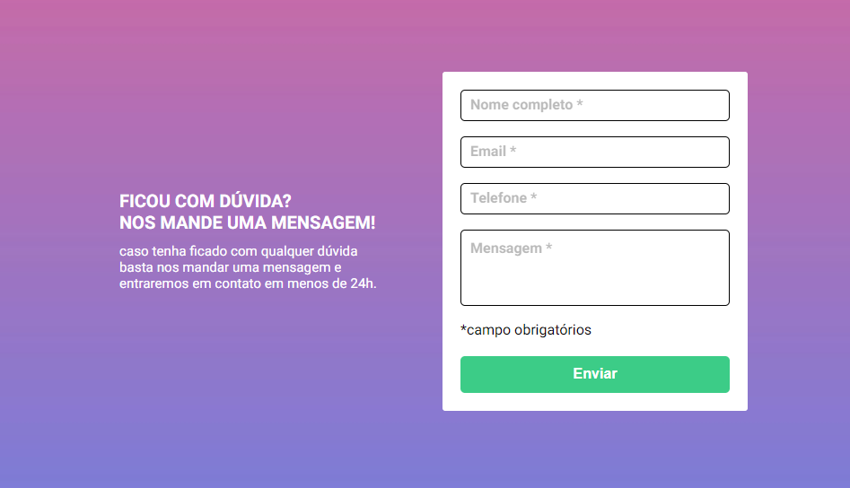

  

## 🖥️ Projeto
Esse é um projeto Web Responsivo do FrontEnd Mentor e DevQuest.

## 🚀 Tecnologias
Esse projeto foi desenvolvido utilizando HTML, CSS, FLEX E JAVASCRIPT com as seguintes tecnologias:

- HTML
- CSS
- JAVASCRIPT
- Git e Github